<!--

author: Julian Cremerius (FAU/SODa)

comment: Dieser Kurs soll in die Grundprinzipien der photographischen 3D-Digitalisierung einführen.

version: 0.1.0
email: julian.cremerius@fau.de

icon: ./res/soda.png

mode: Slides

dark: false

theme-color: yellow

-->

# Basics 3D

---

<!-- style="display: block; float: none; width: 80%; margin-left: auto; margin-right: auto;" -->

Willkommen zu unserer Basic-3D-Pipeline OER!
  
Im Zuge dieses kleinen Tutorials wollen wir euch mit dem 3D-Digitalisierungsprozess in seiner einfachsten Form und den grundlegenden Prinzipien vertraut machen. 
  
Es werden daher keinerlei Grundkenntnisse vorausgesetzt und bedarf auch keiner kostenpflichtiger Software. 
Die erzielten Resultate zwar schnell erstaunliche Qualität erreichen, bleiben aber natürlich hinter denen professioneller Digitalisierung zurück. 
Um die Qualität der Ergebnisse zu steigern, empfehlen wir modular und schrittweise die eingesetzten Mittel und Methoden aufzuwerten (Aufnahmesetup, Rekonstruktionssoftware, Nachbearbeitung).

## Einführung

#### Was ist unser Ziel?

Diese Lernressource ist offensichtlich nicht für Leute gedacht, die in ihrem Arbeitsalltag bereits erfolgreich und routiniert 3D-Digitalisate erschaffen.
Wir hoffen an dieser Stelle alle, die das Thema 3D-Digitalisierung zwar mit Interesse betrachten, aber vielleicht auch mit großem Respekt oder Unverständnis bisher umgehen, davon Überzeugen zu können, dass der schwierigste Schritt schon mit dem bloßen Anfangen geschafft ist. Um an das heranzuführen und zur 3D-Digitalisierung zu motivieren, versuchen wir hier gemeinsam:

- Das Konzept und die Technik hinter der 3D-Digitalisierung mittels Photogrammetrie zu verstehen
- Mit den grundlegenden Arbeitsschritten und Prozessen der Digitalisierung bekannt zu werden
- Ansatzpunkt & Motivation zu bekommen um in Zukunft auch selber Photogrammetrie einzusetzen
- Interesse wecken und Ausblicke geben, nicht nur zum Einsetzen, sondern auch zum Vertiefen und modularen Verbessern des eigenen Arbeitsprozesses

#### Der Weg zum professionellen Digitalisieren

Auch wenn der Umfang des Tutorials im Sinne der Einsteigerfreundlichkeit überschaubar gewählt ist, versuchen wir den 3D-Digitalisierungsprozess in seiner Gänze zu umreißen und sprechen bisweilen Arbeitsschritte an,
die für erste Versuche & Hobbymäßige Aufnahmen nicht vonnöten sind, im Übergang hin zu professionellem Einsatz aber stark an Relevanz gewinnen.

Der Prozess ist der Übersicht halber in drei Arbeitsschritte aufgeteilt - Die Aufnahme, die Nachbearbeitung & die Publikation des Modells.
Als Konzept für den weiterführenden Einstieg in die professionellen Digitalisierungsarbeit empfehlen wir, die einzelnen Arbeitsschritte mit steigendem Qualitätsanspruch modular auszubauen und die verwendete Soft- & Hardware schrittweise durch hochwertigere Alternativen zu ersetzen. Der Digitalisierungsprozess kann mit nahezu unbegrenztem Aufwand und Mitteleinsatz durchgeführt werden, oft ist gewünschte oder notwendige Qualität aber bereits mit erstaunlich moderatem Einsatz erreichbar.

#### Wieso genau PolyCam & Sketchfab? (Disclaimer)

Wir verwenden im Laufe des Tutorials sowohl die Smartphone-App [**Polycam**](https://poly.cam) als auch den Webservice [**Sketchfab**](https://sketchfab.com).   
Während beiderlei Software kostenpflichtige Features hinter Abonnements zurückhalten, empfehlen und verlangen wir in diesem Tutorial ***nicht*** den Abschluss eines solchen Abonnements - alle im Folgenden notwendigen Features stehen vollkommen kostenfrei zur Verfügung und verlangen lediglich die Erstellung eines jeweiligen Benutzeraccounts.  
Aus diesem Grund präsentieren und besprechen wir zu beiden Programmen Alternativen, die bei Bedarf ebenfalls eingesetzt werden können - einige Arbeitsschritte unterscheiden sich in diesem Falle natürlich.

Es besteht keine Kooperation mit den Diensten und dies stellt weiterhin keine kommerzielle Empfehlung der Dienste unsererseits dar. Die Festlegung auf spezifische Dienste dient einzig und allein der konsistenten Darstellung von spezifischen Use-Case Beispielen.  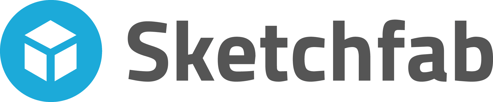
Grund für die Wahl der betreffenden Software ist unser primäres Ziel der Bekanntmachen & Vorstellung der Methodik.  
Da es sich dementsprechend um ein Einsteiger- und Ausprobier-Tutorial handelt sollen keine Kosten & minimaler Aufwand hervorgerufen werden (reine Open-Source Software ist häufig Einarbeitunsintensiv).
Um weiterhin keine Anforderungen im Bezug auf teure & leistungsfähige Hardware zu stellen, beschränken wir uns auf Smartphone-Apps & Web-Apps, die auf jedem mobilen Gerät verwendet werden können.
  
Wir hoffen, durch unsere Wahl einen reibungslosen Ablauf und schnelle Erfolge bereiten zu können, unterstützen aber jederzeit die Wahl alternativer Software.

## Part 1 - Aufnahme

#### Kleiner Theorie-Einblick

{{0-1}}
Hinter jeder herkömmlichen Photogrammetrie-Software versteckt sich die sogenannte *Structure-from-Motion*  Methode.
Im Folgenden geben wir einen kleinen Überblick über die grundlegende Algorithmik - ein tieferes technisches Verständnis der Methodik ist für die 3D-Modell-Aufnahme zwar nicht zwingend notwendig, aber kann oft helfen, Fehler und entsprechende Fehlerquellen bei der Anwendung schnell zu identifizieren und zu vermeiden.
  
*Structure-from-Motion* (*SfM*), also 'Struktur aus Bewegung', beziehungsweise etwas freier übersetzt - 'Formerkennung durch Betrachtung aus verschiedenen Perspektiven' bezeichnet das allgemeine Konzept, die 3-dimensionale Form & Geometrie eines Objekts auf Basis mehrerer 2-dimensionaler Beobachtungen herauszufinden bzw. zu berechnen. In der *Computer Vision*-Forschung hat sich hierfür ein ganz bestimmter Prozess etabliert, den wir uns nun genauer anschauen wollen.

{{1-2}}
Wie aus der Methoden-Bezeichnung bereits hervorgeht, ist für die *SfM*-Aufnahme alse eine Reihe von regulären 2D-Fotoaufnahmen notwendig.
Es handelt sich im Grunde um klassische Objektphotographie, die aus mehreren Blickwinkeln wiederholt wird, bis eine ausreichende Abdeckung des Objekts aus allen Richtung erreicht ist. (Die Fotografischen Standards & Anforderungen unterscheiden sich jedoch etwas von denen der klassischen Objektphotographie.)    

{{1-2}}

    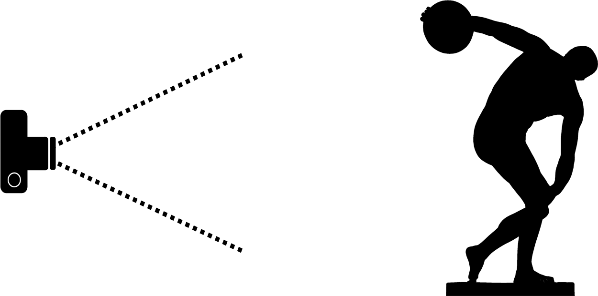
    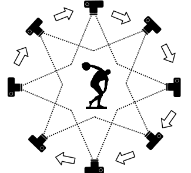

{{2-3}}
Bevor das Modell selber aber berechnet werden kann, fehlt an dieser Stelle noch eine wichtige Information - In welchem räumlichen Verhältnis stehen die einzelnen Kameraperspektiven zueinander?
Da entweder die Kamera oder das Objekt zwischen den Aufnahmen bewegt werden muss und eine technische Messung der Bewegungen häufig nicht akkurat genug ist, wird versucht diese räumlichen Verhältnisse aus den Bildern selbst zu bestimmen.    

{{2-3}}

    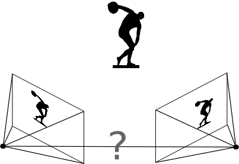
    

{{3-4}}
Für diese Berechnung ist es notwendig, visuelle *Features* (= Merkmale) der abgebildeten Szene in einer Vielzahl verschiedener Bilder wiederzuerkennen. Hier kommen daher sogenannte *Feature Detection*-Algorithmen zum Einsatz, insbesondere *SIFT* (= *Scale-invariant feature transform*, optimiert für Wiedererkennung von Merkmalen trotz verschiedener Größen/Rotation/Belichtung) oder *SURF* (= *Sped-up robust features*, ein Kompromiss zwischen schnellerer Laufzeit und robusten Ergebnissen). Das Ergebnis dieser *Feature Detection* sieht wie folgt aus:    

{{3-4}}

    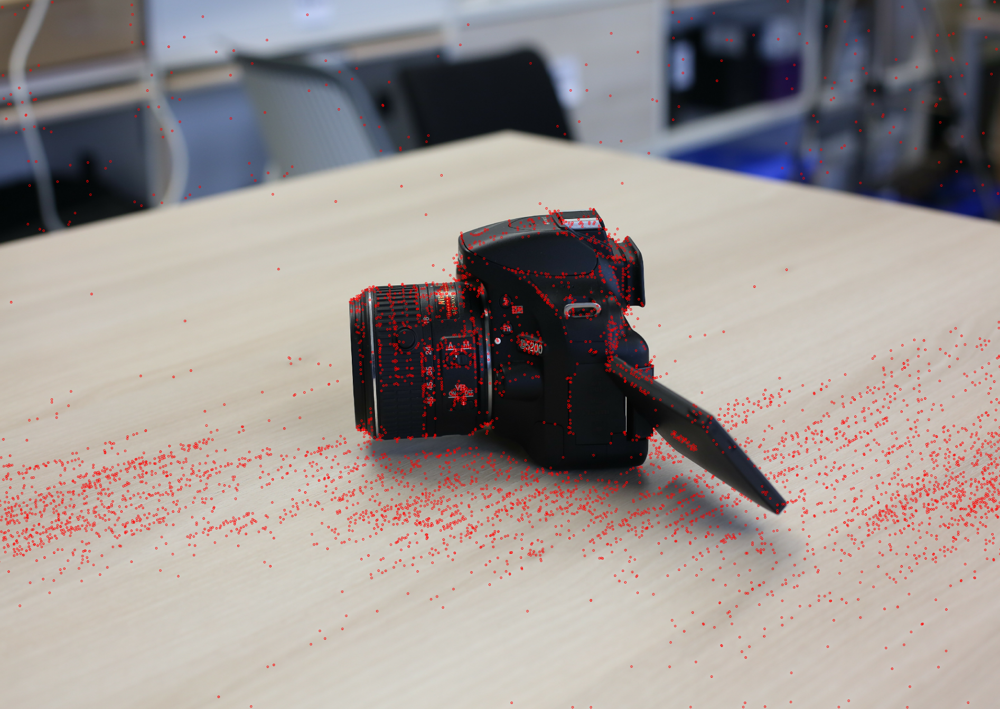
    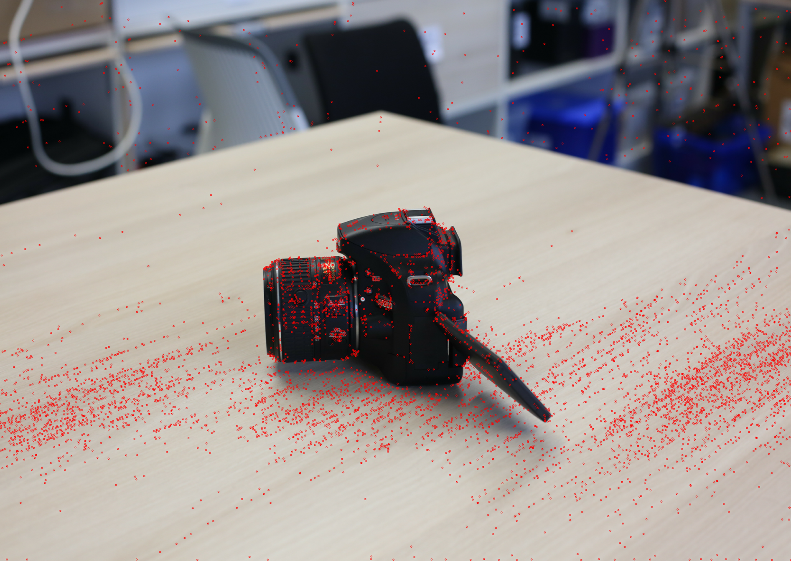

{{4-5}}
Da all diese *Features* aufgrund ihres hohen Wiedererkennungswertes ausgesucht wurden, ist nun ein *Feature Matching* (= Merkmalsabgleich) möglich, wobei zu allen *Features* eines Bildes korrespondierende 'Partner'-*Features* in anderen Bildern gesucht werden.      

{{4-5}}

{{5-7}}
Da an diesem Punkt (hoffentlich) ausreichend Zusammenhänge zwischen den Kameraperspektiven und den von ihnen gesehenen Szenenbereichen bekannt sind, ist hier eine Triangulation der Kamerapositionen zueinander möglich.
Ausgehend von einer beliebigen Kameraperspektive und den erkannten *Features*, werden nach und nach zusätzliche Perpektiven ausgerechnet und in die Szene hinzugefügt. Diese Berechnungen liefern uns zwei wichtige Ergebnisse:

{{5-6}}
1. Die räumlichen Verhältnisse zwischen den Kameras & 

{{5-6}}
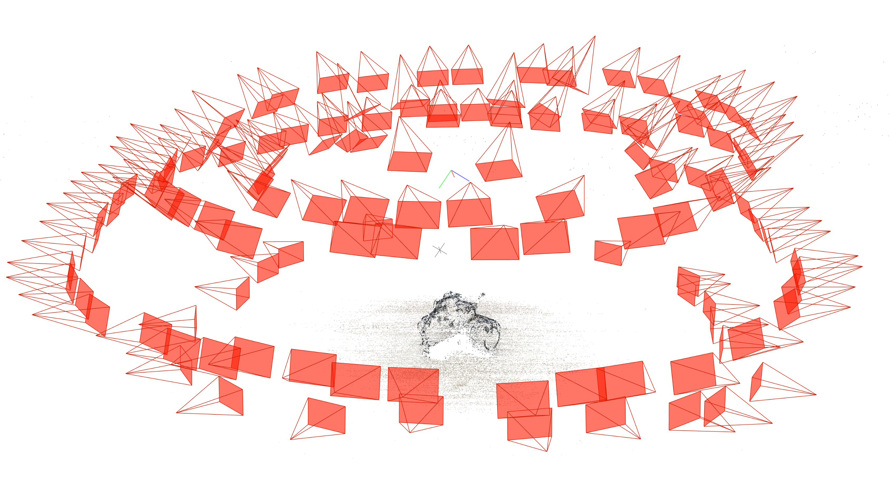

{{6-7}}
2. Die sog. *Sparse Point Cloud* (= dünn besetzte Punktewolke)

{{6-7}}
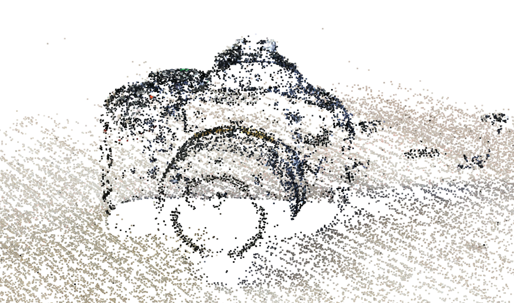

{{7-8}}
Auf Basis der *Sparse Point Cloud* wird danach noch einmal jedes Bild betrachtet, und Bildpunkte, die zuvor nicht bereits als *Features* genutzt wurden, werden verwendet, um die Punktwolke langsam zu verdichten.
Wenn alle Bilder noch einmal durchgegangen wurden, erhalten wir die *Dense Point Cloud* (= dicht besetzte Punktwolke).

{{7-8}}
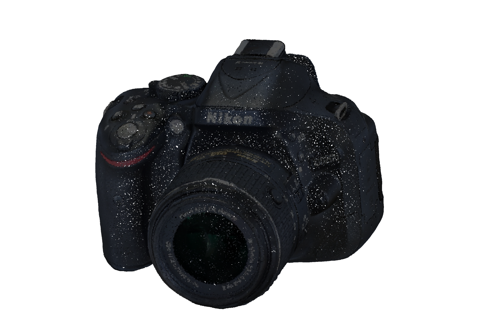

{{8-9}}
Die Verwendung von Punktwolken zur Geometriedarstellung hat allerdings diverse Nachteile und wird von vieler Software und auch Hardware nicht effizient oder auch garnicht unterstützt.
Daher ist häufig die Umrechnung zu einem *(Polygon) Mesh* (= Polygonnetz, üblichste 3D-Geometriedarstellung) wünschenswert, viele Photogrammetrie-Programme führen diesen Schritt auch automatisch mit aus.
Nachdem das *Mesh* berechnet wurde und die Texturen darauf projiziert wurden, erhalten wir schließlich das Endresultat der Photogrammetrie:    

{{8-9}}

    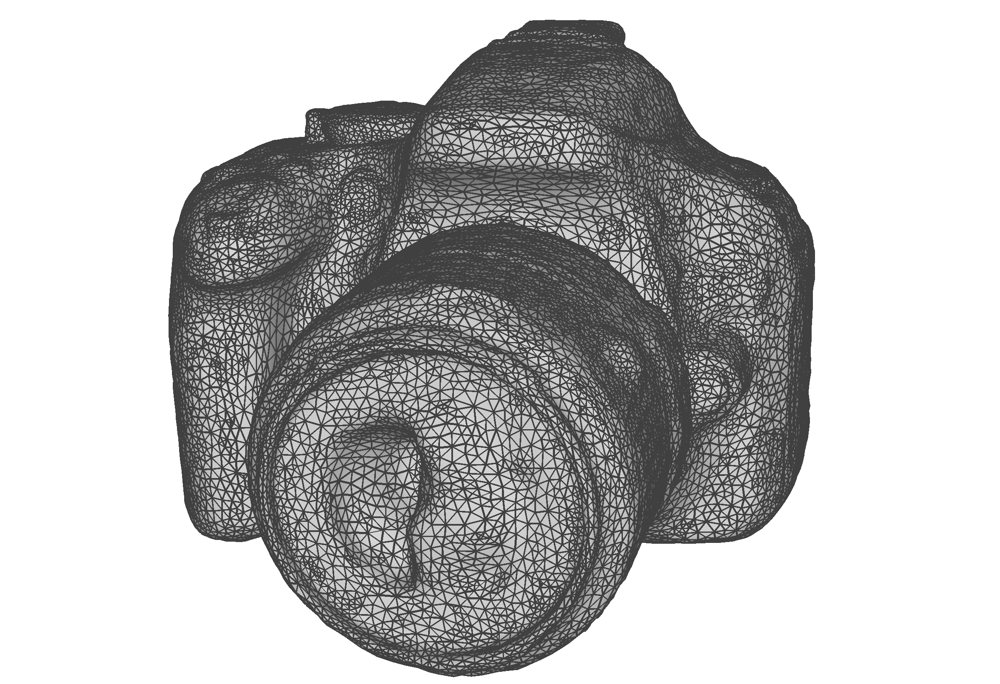
    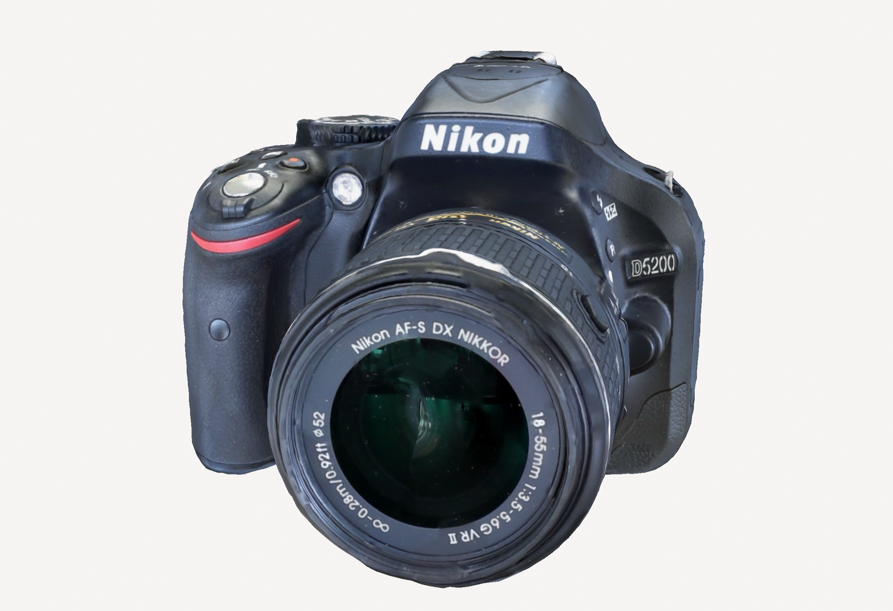

#### Vorbereitung

{{0-1}}
Setup einer Aufnahme-App
===

{{0-1}}
Bevor wir uns mit der 3D-Aufnahme selber beschäftigen können, braucht es selbstverständlich ein Aufnahme-Setup.  
Im Falle der Photogrammetrie kann so ein Aufnahme-Setup zwar fast beliebig aufwendig und teuer werden (DSLR Kamera, Studio-Beleuchtung, Polfilter, mech. Drehteller, etc), aber zum Glück auch fast beliebig schlicht gehalten werden.  
Die einzige unabdingbare Voraussetzung ist eine Kamera - über die bereits jedes heutige Smartphone verfügt.
  
Wir könnten also direkt anfangen und eine Reihe Photos mit dem Smarthphone machen, die wir dann später an eine Photogrammetrie-Software (wie z.B. **MetaShape**, **RealityCapture**) weitergeben, um uns ein Modell zu berechnen. 
Inzwischen gibt es allerdings auch viele benutzerfreundliche, Smartphone-basierte Photogrammetrie-Apps, die den ganzen Prozess von Aufnahme bis zum (nachbearbeiteten) Modell integrieren.
  
In dieser Demo verwenden wir daher solch eine App, **Polycam**. Aber auch **RealityScan**, **KIRI Engine** oder **Scaniverse** stehen hier als vergleichbare Alternativen mit kleineren Unterschieden in Verfügbarkeit von Features, Qualität und Kostenmodell zur Verfügung. 
Alle dieser Optionen sind kostenlos benutzbar, nachdem die Berechnung der 3D-Modelle aber erheblichen Rechenaufwand für den Anbieter erzeugt besteht oft eine Limitation der kostenlosen Aufnahmen, eine Obergrenze für die Anzahl an Fotos pro Aufnahme, oder begrenzte Export-Dateiformate, etc.
  
Alle Apps können je nach Smartphone über den Google Play Store oder den Apple App Store installiert werden.

{{0-1}}
|              |                                                                                           |                                                                                |
| ------------ | :---------------------------------------------------------------------------------------: | :----------------------------------------------------------------------------: |
| Polycam:     |         [Android](https://play.google.com/store/apps/details?id=ai.polycam&hl=en)         |   [iOS](https://apps.apple.com/de/app/polycam-lidar-3d-scanner/id1532482376)   |
| RealityScan: | [Android](https://play.google.com/store/apps/details?id=com.epicgames.realityscan&hl=en)  | [iOS](https://apps.apple.com/de/app/realityscan-3d-scanning-app/id1584832280)  |
| KIRI Engine: |     [Android](https://play.google.com/store/apps/details?id=com.kiriengine.app&hl=en)     | [iOS](https://apps.apple.com/de/app/kiri-engine-3d-scanner-lidar/id1577127142) |
| Scaniverse:  | [Android](https://play.google.com/store/apps/details?id=com.nianticlabs.scaniverse&hl=en) |    [iOS](https://apps.apple.com/de/app/scaniverse-3d-scanner/id1541433223)     |

{{0-1}}
Nach Installation der gewählten App ist in den meisten Fällen auch die Registrierung eines Benutzerkontos nötig - das Abschließen eines kostenpflichtigen Abos ist bei keiner dieser Apps notwendig! Das Tutorial kann mit den kostenlos verfügbaren Features durchgeführt werden.

{{1}}
Aufnahme-Objekt & -Setup
===

{{1}}
Natürlich benötigen wir auch noch ein Objekt, von dem wir ein 3D-Modell erzeugen wollen. In der Praxis wird der gesamte Aufnahmeprozess selbstverständlich für ein bestimmtes Objekt oder eine Objektgruppe geplant - um sich mit der Methodik vertraut zu machen empfiehlt sich hier aber im ersten Anlauf die Wahl eines gut geeigneten Objekts. Auf die technische Grundlage der Methode zurückblickend ergeben sich hierfür zwei primäre Anforderungen:

{{1}}
* Auf der Oberfläche des Objekts müssen **Features** erkannt werden können
  
  * d.h. große glatte & einfarbige Flächen eignen sich nicht gut für die Photogrammetrie

* Die erkennbaren **Features** müssen aus benachbarten Perspektiven wiedererkennbar sein

  * d.h. transparente & reflektive Oberflächen, deren Aussehen stark blickwinkelabhängig ist sind ebenfalls nicht optimal

{{1}}
Eben diese Anforderungen stellen auch die größte Limitation der Photogrammetrie dar, mit spezieller Belichtung, Polfiltern oder Oberflächensprays kann diesen Problemen oft entgegengewirkt werden, dies ist jedoch mit zusätzlichem Aufwand verbunden und keine Garantie für Erfolg.
  

{{1}}
---

{{1}}
Der wichtigste Umgebungsfaktor für die Aufnahme besteht in der Beleuchtung unserer Szene - je geringer der direkte Lichteinfall ist, desto besser. Gleichzeitig soll das Objekt natürlich ausreichend beleuchtet sein, um gut erkannt und abgebildet zu werden. Das Optimum besteht in einer diffusen, gleichmäßigen Ausleuchtung des Raumes ohne direkte "Lichtbestrahlung". Bei 3D-Aufnahmen im Freien eignen sich insbesondere helle, aber bedeckte Tage, in geschlossenen Räumen werden bestenfalls sogennante *Softboxen* oder Fotozelte verwendet. Zum Zwecke dieses Tutorials reicht es allerdings vollkommen aus, das Objekt nicht zu direkt "anzustrahlen".
  
Eine leergeräumte Tischplatte reicht vorerst vollkommen als Hinter- bzw. Untergrund für die Aufnahme. Stark gefüllte & bunte Hintergründe können in manchen Fällen zur Fehlerquelle werden (Führt zu vielen zusätzlichen Features im Hintergrund -> Gut für die Orientierung der Kameras, kann aber die Objektrekonstruktion stören)

{{1}}

#### Capturing - How to?
  

  

    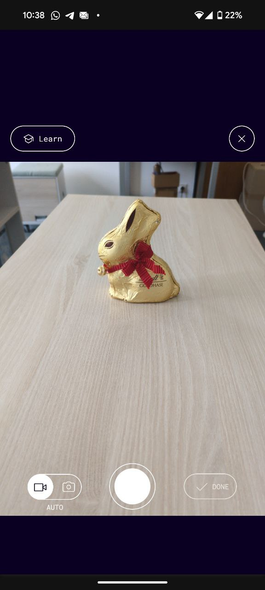
    
 *Start-Ansicht von Polycam* 

  

  

    
    
 *PLATZHALTER für Capturing-gif* 

  

 Wie nehme ich auf?
=== 

  Ist alles vorbereitet kann es nun an die eigentliche Aufnahme gehen.
   
  Öffnet man **Polycam**, wird man direkt mit dem Aufnahme-Interface begrüßt, bei manchen anderen Apps muss manuell eine **Neue Aufnahme/New Capture** geöfnet werden.
  Die einzige verfügbare Einstellung ist hier die Auswahl zwischen der Aufnahme einzelner Photos ('Manual') und der "Video"-Aufnahme ('Auto'). Um die Aufnahme verwackelter Bilder während der Bewegung bzw Umpositionierung zu vermeiden empfiehlt sich hier die manuelle Aufnahme.

  Das einfachste "Aufnahmemuster", um eine gute Abdeckung zu erreichen ist das kreisförmige Umrunden des Objekts bei regelmäßigem Fotografieren, beispielsweise alle 10-20° (~20 Bilder/Umrundung) oder frei Hand nach jedem "Seitwärtsschritt"(siehe Abbildung).
  Um die Abdeckung weiterhin zu verbessern werden diese Umrundungen auf verschiedenen Höhen wiederholt (min. 2-3 mal; z.B. eine Umrundung je auf Augenhöhe/Brusthöhe/Hüfthöhe, angepasst an Objekt- und Tischgröße natürlich).
   
  Bei einfachen Objekten ist eine Gesamtaufnahme von ca. 40-50 Bildern (2 Ringe zu je 20-25 Bildern) bereits ein zuverlässiges Mindestmaß, spätestens 3-4 Ringe zu je 30-40 Bildern sind in den allermeisten Fällen vollkommen ausreichend.

  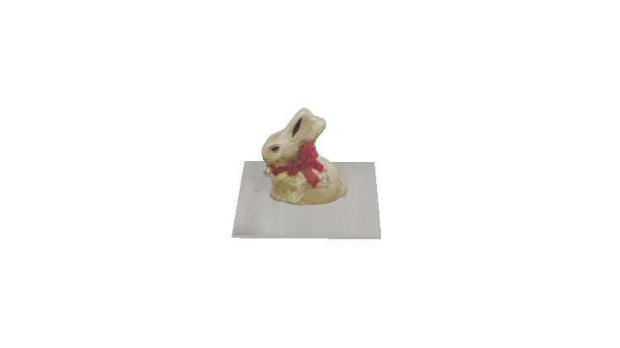

  

 Probleme?
=== 

  **Ich habe nicht genug Platz, um das Objekt zu umrunden?**
   
  Fast alle Photogrammetrie-Apps unterstützen das sogenannte *Object Masking*, hierbei wird versucht das "Zielobjekt" der Aufnahme zu identifizieren und nachfolgend all **Features** abseits des Objektes ignoriert. Dadurch besteht praktisch kein Unterschied mehr zwischem einem "Herumlaufen" um das Objekt und einer schrittweisen Rotation des Objektes selbst. Achtung - bei weichen, deformierbaren Objekten besteht die Gefahr das Objekt zu verformen, hier empfiehlt sich ein Drehteller oder anderweitige Unterlage, mittels der das Objekt gedreht werden kann.

  **So wird ja die Unterseite des Objektes garnicht gesehen!**
   
  Richtig, auch hier kann aber das *Object Masking* helfen. Solide Objekte können dabei beliebig umgedreht, hingelegt und rotiert werden, ohne die Rekonstruktion zu beeinträchtigen. Dadurch kann auch die Unterseite mit aufgenommen werden. Dies gestaltet sich bei deformierbaren Objekten jedoch schwierig, Option ist hier das Aufhängen oder anderweitige Suspendieren in der Luft, um auch Fotoringe von unterhalb aufnehmen zu können.

  

    

      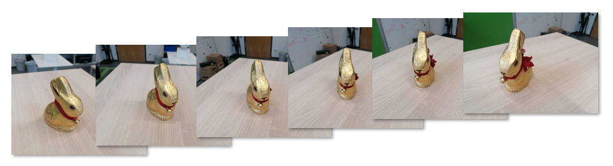
    

    

      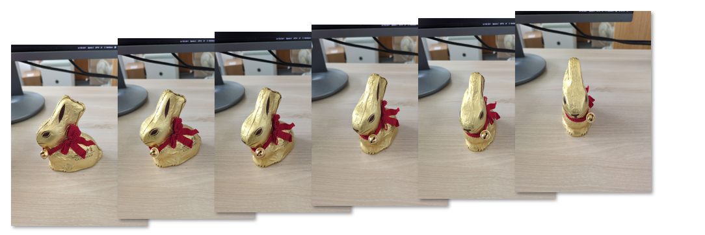
    

  

  

    

      
 Photoserie ohne Bedarf für *Object Masking*  (Kamera bewegt sich um Objekt, Objekt ist statisch im Bezug auf Umgebung) 

    

    

      
 Photoserie mit Bedarf für *Object Masking*  (Kamera statisch, Objekt wird gedreht und verschiebt sich im Bezug auf Umgebung) 

    

  

  

 Alles fertig?
=== 

Sind alle gewünschten Blickwinkel auf das Objekt ausreichend abgedeckt, kann die Aufnahme schließlich beendet werden.
Abschließend kann noch die gewünschte Qualität des 3D-Modells (beeinflusst auch die Dateigröße! - am besten 'Medium' oder 'Full') eingestellt, und bei Bedarf das bereits erwähnte *Object Masking* aktiviert werden.

    

      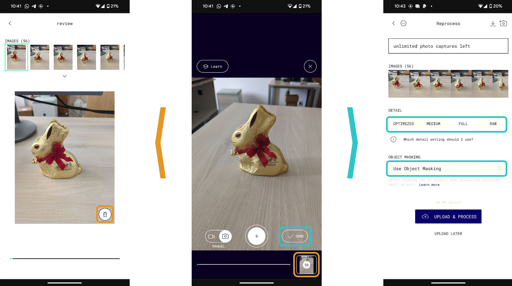
    

  

  

    

      
 Im *Review*-Modus können bisher genommene Photos überprüft und bei Bedarf wieder entfernt werden. 

    

    

      
 Bei Projekt-Abschluss können gewünschte Qualität sowie *Object Masking* eingestellt werden. 

    

  

Da die Erstellung des 3D-Modells sehr rechenintensiv ist, wird der Prozess nicht lokal auf dem Smartphone gestartet. Stattdessen verwenden alle Photogrammetrie-Apps an dieser Stelle *Cloud Computing*, wobei die aufgenommenen Bilder an einen Server geschickt werden, der die Berechnung übernimmt (WLAN verwenden um übermäßigen Datenverbrauch zu vermeiden). Klassischerweise ergibt sich daraus eine Wartezeit von ca. 5-10 Minuten, bis das fertige Objekt in der Projekt-Gallerie der App betrachtet werden kann.

   
***Erfolg! - Schon haben wir ein erstes eigenes 3D-Modell erzeugt!***

## Part 2 - Nachbearbeitung

Ein wichtiger Schritt bei der Erzeugung hochwertiger 3D-Digitalisate besteht in der richtigen Nachbearbeitung der Modelle.
Je nach Verwendungszweck kann die Nachbearbeitung im "Low-End"- & Hobbybereich der Photogrammetrie noch recht knapp ausfallen, unter anderem weil viele Photogrammetrie-Apps bereits einige automatisierte Nachbearbeitungsschritte durchführen. Bei höheren Qualitätsansprüchen und der Notwendigkeit für individuelle Nachbearbeitung steigt dieser Aufwand jedoch schnell.
  
Auch wenn das erzeugte Modell auf den ersten Blick gut rekonstruiert scheint, gibt es noch einige Anhaltspunkte, die geprüft und bei Bedarf nachgebessert werden sollten, um das Digitalisat weiterverwendbar zu machen.
Die häufigsten Problemfälle & Optimierungsmöglichkeiten und wie wir mit ihnen umgehen können wollen wir uns jetzt genauer anschauen.

Um das Objekt genauer zu betrachten und zu verändern, wählen wir es aus der Projektgallerie aus und kommen dadurch in das Bearbeitunsmenü.

Tipp: Polycam besitzt auch ein [Webinterface](https://poly.cam). Wenn ihnen ein Desktop-PC oder Laptop zur Verfügung steht haben sie auch dort Zugriff auf alle bereits an den Server übermittelten Projekte. Die Nachbearbeitung ist hierüber meist angenehmer als über einen Smartphone-Touchscreen.

> ***Origin*** 
> Der sogenannte *Origin* (= Ursprung) oder Mittelpunkt des Objektes liegt manchmal nicht im Zentrum der 3D-Szene.
> Dies ist ein eher seltenes Problem bei automatisierten Photogrammetrie-Pipelines und kann daher z.B. in Polycam nicht bearbeitet werden.
> Wichtig für den Import des Modells in andere Software.  
>
> 

> ***Rotation*** 
> Ähnlich zum *Origin* ist auch die Orientierung des Objektes oft unerwartet im Verhältnis zu den Hauptachsen der 3D-Szene.
> Da die Software meist nicht von selbst feststellen kann, wo bspw. "oben" ist, wird die Rotation z.T. arbiträr gesetzt, dadurch entsteht unerwünschtes Verhalten beim Drehen und Bewegen des Objektes und beim Import in andere 3D-Software. 
> Hier gibt uns Polycam die Möglichkeit, das Objekt neu zu Orientieren. Dazu einfach unter **Rotate** das Objekt mittels der bunten "Anfasser" drehen, bis die gewünschte Orientierung im Bezug zu der Bodenfläche (graues Gitter) erreicht ist. Wird die Änderung angewendet, sollte ein merklich natürlicheres Rotationsverhalten bei Betrachtung zu beobachten sein.
>
>
>
>

> ***Skalierung*** 
> Auch die Größe des Originalobjekts ist häufig nicht korrekt im 3D-Modell abgebildet. Dies ist abermals beim Import in andere 3D-Szenen ein Problem, aber auch bspw. bei der Analyse und Beforschung eines digitalisierten Objekts.
> Zur Korrektur können unter **Rescale** Punkte auf dem Modell ausgewählt werden, deren reale Distanz voneinander bekannt ist bzw. ausgemessen wurde (Bei professioneller Anwendung werden hierfür standartisierte Marker am oder neben dem Objekt angebracht). Die Distanz der Punkte in der digitalen Szene kann dann dementsprechend angepasst werden.
>
> 

> ***Outlier*** 
> Als *Outlier* (= Ausreißer) versteht man bei 3D-Modellen einzelne Punkte, Kanten oder Flächen (die Grundbausteine eines *Meshes*), die nicht mit dem Hauptobjekt verbunden sind - diese Artefakte entstehen entweder aus falsch erkannten *Features* bei der Modellberechnung oder später bei der Umwandlung der Punktewolke zum *Mesh*. Eine grundlegendes *Outlier Removal* wird von den meisten Photogrammetrie-Apps standartmäßig durchgeführt. Darüber hinaus gibt es in Polycam keine manuelle Bearbeitungsmöglichkeit.
>
> 

> ***Unerwünschte(r) Hintergrund(objekte)*** 
> Insbesondere bei der Photogrammetrie ohne *Object Masking* beinhaltet die rekonstruierte Szene meist noch Teile und Objekte des Hintergrundes (Tischplatte, Wände, zusätzliche Objekte).
> Sofern die Digitalisierung des gesamten Raumes bzw. der Gesamtszene jedoch nicht Ziel der Aufnahme war, ist es sinnvoll die Szene auf das gewünschte Objekt zu reduzieren. 
> Hierfür kann via **Crop** entweder eine Box oder ein Zylinder definiert und über die "Anfasser" angepasst werden, die ausschließlich das Objekt beinhalten, oder es werden über die **Crop Out** Option in mehreren Schritten einzelne unerwünschte Teile des Objektes weggeschnitten.
>
> 
> 

> ***Farbe & Ton*** 
> Ist die allgemeine Färbung des Objektes nicht zufriedenstellend, können gewisse Änderungen bzgl Farbsättigung, Kontrast, Temperatur etc. auch nachträglich noch unter **Color** angepasst werden.
> Sind jedoch nur stellenweise unerwünschte Verfärbungen oder Hell-Dunkel-Wechsel aufgetreten ist dies häufig ein Hinweis auf ungleiche/unausreichende Beleuchtung des Objektes bei der Aufnahme - derartige Fehler sind schwer nachträglich zu beheben und erfordern oft eine Neuaufnahme des Objektes.
>
> 

> ***Geometrie-Auflösung/Dateigröße*** 
> Je nach weiterem Verwendungszweck bestehen oft sehr spezifische Anforderungen an die Detail-Auflösung der Geometrie oder die allgemeine Dateigröße. 
> Die Auflösung im Nachhinein zu erhöhen ist allerdings nur schwer möglich und erfordert eine Neuberechnung des Modells mit anderen Detaileinstellungen und/oder mehr bzw. besseren Aufnahmebildern. 
> Eine Reduktion der Auflösung/Dateigröße um beispielsweise das Datenlimit einer Webseite zu erfüllen ist jedoch in fast jeder Photogrammetrie-Software nachträglich möglich.
> Hierzu kann in Polycam unter **Remesh** ein expliziter Reduktionsfaktor oder eine gewünschte Polygonzahl (Anzahl einzelner Flächen im *Mesh*) angegeben werden. Die Einstellung **Uniform** sorgt dabei für eine gleichmäßige Reduktion der Auflösung über das *Mesh* hinweg, während bei **Adaptive** versucht wird, an detailreichen Stellen des Objektes hohe Auflösung zu bewahren und sie an detailärmeren Stellen ausgleichend stärker zu reduzieren.
> Auch die Texturauflösung kann reduziert werden, der Einfluß auf die Dateigröße ist hier aber häufig geringer als im Falle der Geometrie.
>
> 

> ***Textur- & Geometrie-Fehler*** 
> Treten bei der Rekonstruktion erkenntliche Fehler bei der Geometrie oder den Texturen auf, ist dies meist ein Indiz für schlechte Abdeckung der betreffenden Bereiche bei der Aufnahme, oder für problematisches Material (reflektive/transparente Objektteile). Durch einfache Nachbearbeitung ist dies kaum zu beheben, entweder müssen die fehlerhaften Bereiche in einem externen Programm manuell nachmodelliert werden, oder es wird eine Neuaufnahme versucht.
> Eine dritte Option besteht hier je nach Software noch in der Erweiterung der bisherigen Aufnahme um zusätzliche Bilder. Polycam bietet dazu die **Extend**-Option an, die einen zurück in den Aufnahmemodus versetzt, bei der Modellberechnung aber vorhergehende Bilder miteinbezieht.
>
> 
> 

> ***Dateiformat bei Export*** 
> Eine Weiterverwendung der Modells setzt selbstverständlich einen Export der Modelldatei voraus. Während eine nachträgliche Umwandlung zwischen Dateiformaten oft möglich ist, gehen in manchen Fällen bestimmte Informationen verloren.
> Leider ist die Wahl des Exportformates in vielen Photogrammetrie-Apps ein kostenpflichtiges Feature - bei Polycam wird bspw. nur der Export als .glb/.gltf-Datei kostenfrei angeboten. Insbesondere für Weiterverwendung im Webkontext ist dieses Format inzwischen der de-facto Standart und kann problemlos für die Publikation des Objektes auf Webseiten oder Ähnlichem verwendet werden.
> 

Wie bereits erwähnt ist insbesondere bei voll-automatisierter Photogrammetrie-Software sowohl der Bedarf nach Nachbearbeitung als auch die Möglichkeit dazu eher beschränkt. Viele Optimierungen werden auf sehr generelle Weise automatisch durchgeführt anstatt spezifische Einstellungen vom Nutzer zu erwarten oder zu verlangen. Umfangreichere, industrieller orientierte Software bietet hier mehr Freiheiten, fordert aber auch oft eine tiefergehende Auseinandersetzung mit der Software und den einzelnen Nachbearbeitungsschritten. Zusätzlich besteht unabhängig von der Photogrammetrie-Software noch die Möglichkeit zur Nachbearbeitung in externer 3D-Software. Zum Beispiel in der 3D-Modellierungs & Animations-Software **Blender** können alle beschriebenen und viele weitere Nach- und Weiterverarbeitungsschritte vorgenommen werden. Da jedoch ausschließlich die Photogrammetriesoftware selbst über die Rohdaten der Rekonstruktion verfügt, ist es empfehlenswert, alle möglichen Nachbearbeitungen bereits dort vorzunehmen.

## Part 3 - Publikation

#### Weiterverwendung von 3D-Modellen

Nach der Erzeugung und erfolgreichen Nachbearbeitung kann und soll das 3D-Modell nun auch verwendet werden. 
Die genaue Art und Weise der Nutzung sollte natürlich sofern möglich im Vorhinein geplant sein, da Aufnahmesetup & -qualität sowie die Nachbearbeitung für die Weiternutzung optimiert werden müssen.

In unserem Fall wollen wir das Modell einfach nur öffentlich zur Verfügung stellen, ohne eine eigene Webseite oder eigene Serverkapazitäten aufwenden zu müssen. Daher fällt auch hier die Wahl hier wieder auf einen Webanbieter.
Die bekanntesten Optionen zur Zeit sind Sketchfab, ein allgemeiner Markt- & Austauschplatz für 3D-Modelle mit sehr großem Publikum aber leider noch ungeklärter Zukunft, sowie kompakkt, eine kleinere, nicht-kommerzielle Alternative, die allerdings mit Fokus auf Digital Humanities-Bedarfe entwickelt wurde.

Aufgrund der Popularität von **Sketchfab**, und da neue **kompakkt**-Nutzer die Uploadfunktion erst manuell von Seiten der Betreiber genehmigt bekommen müssen, werden wir uns für dieses Tutorial an **Sketchfab** halten, der Uploadprozess beider Seiten ähnelt sich jedoch stark.

#### Publikation auf Sketchfab

Auch Sketchfab erwartet vor der Nutzung wieder eine kostenlose Registrierung von seinen Nutzern. Nach Mail-Verifikation, optionaler Profileinrichtung und Wahl des Abonnements (kein kostenpflichtiges Abo notwendig!) kann auch schon direkt losgelegt werden. Nach Wahl der **Upload**-Option kann denkbar einfach über den Dateibrowser oder direktes Drag-and-Drop das gewünschte 3D-Modell ausgewählt werden.

Nach Auswahl der Datei öffnet sich direkt das Bearbeitungsmenü des neuen Eintrags, bis das Modell selbst geladen ist und testweise betrachtet werden kann braucht es noch einen Moment Geduld.

Ist das Modell fertig geladen, kann nun es nun auch über das kleine Viewer-Fenster betrachtet werden oder direkt über die Option **Edit 3D Settings** nachmals bearbeitet werden.
Da **Sketchfab** einen anderen *Renderer* (= 3D-Darstellungsprogramm) als **Polycam** verwendet, sehen viele Objekte erstmal anders aus. Standartmäßig wird die Beleuchtung hier einem industriellen Innenraum nachempfunden, wem dies nicht gefällt, der kann die Beleuchtung entweder manuell nach Wunsch einstellen (Lampen-Symbol), oder auf eine Beleuchtungssimulation verzichten und durch die **Shadeless**-Option die ungefilterte Darstellung der rekonstruierten Objektfarben erzwingen.

Ist die Sichtbarkeit durch den Hintergrund behindert, kann auch dieser hier angepasst werden, sowie ein vorteilhafte initiale Kameraposition definiert werden und viele weitere Änderungen, um das Objekt von seiner besten Seite zu präsentieren. 
Um das Objekt rein zur interessierten Betrachtung zu Veröffentlichen ist an dieser Stelle aber auch kein großer Aufwand erforderlich.
 
Relevante Einstellungen sind weiterhin die Sichtbarkeit (Bei kostenfreier Nutzung zwangsweise "öffentlich") und ob anderen Nutzern die Möglichkeit zum Download des Modells gegeben werden soll sowie die entsprechende Lizenzierung.
Nach Wahl passenden Titels und einer (optionalen) kurzen Beschreibung kann das Modell dann auch schon mit einem Klick auf **Publish** veröffentlicht werden!

Das fertige Modell ist ab sofort öffentlich auf **Sketchfab** verfügbar und kann von allen Interessierten betrachtet werden, und je nach Freigabe auch heruntergeladen und weiterverwendet werden.
   
***Glückwunsch! Wer bis hierhin mitgemacht hat, hat nun erfolgreich sein erstes eigenes Digitalisat erschaffen, nachbearbeitet & publiziert!***

#### Alternativen

Je nach gewünschter Verwendung und eigenen Möglichkeiten & Wünschen bestehen viele Alternativen für die Verwendung von 3D-Modellen im Web.
Folgende Kriterien können beispielsweise ausschlaggebend sein:

> ***Verwendungszweck*** 
> 
> - Datenspeicherung und öffentliche Verfügbarkeit? -> Forschungsdatenportale wie das vom CERN gehostete **Zenodo** bieten sich an
> 
> - Reine Webbetrachtung? -> Einfache Web-Viewer wie von **Sketchfab**, **kompakkt** oder **modelviewer.js** reichen aus
> 
> - Storytelling und kuratierte Zusatzinformation? -> für den Heritage-Sektor optimierte Viewer wie der **Smithsonian Voyager** bieten Lösungen

> ***Ort der Datenspeicherung*** 
> 
> - Dürfen die Daten auf öffentliche/kommerzielle Server gelangen? -> **Sketchfab**, **kompakkt**, **Zenodo**
> 
> - Sollen die Daten im eigenen Haus bleiben und selbst gehostet werden? -> Open-Source Viewer wie **modelviewer.js** oder **Smithsonian Voyager** können problemlos in eigene Webauftritte integriert werden, ohne die 3D-Daten aus der eigenen Hand zu geben

> ***Technische Kapazität*** 
> 
> - Reiner Endnutzer? -> fertige, alleinstehende Produkte wie **Sketchfab** und **Smithsonian Voyager** sind bereits ohne technisches Vorwissen leicht zu verwenden
> 
> - Mittlere IT-Kapazitäten? -> Viewer wie **Smithsonian Voyager** oder **modelviewer.js** können schnell an spezifische Anwendungszwecke angepasst werden
> 
> - Große IT-Kompetenzen/IT-Abteilung? -> Auf Basis von **three.js** oder sogar dem darunterliegenden **WebGL** können vollkommen frei 3D-Webanwendungen entwickelt werden

## Ausblick

