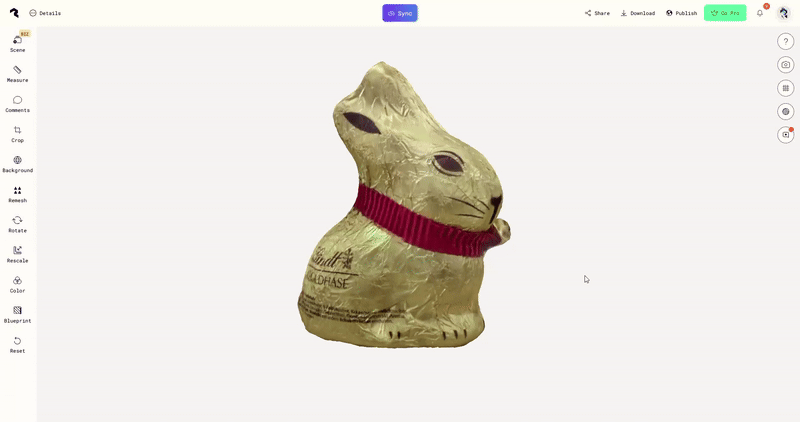
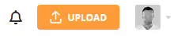

<!--

author: Julian Cremerius (FAU/SODa)

comment: Dieser Kurs soll in die Grundprinzipien der photographischen 3D-Digitalisierung einführen.

version: 0.1.0
email: julian.cremerius@fau.de

icon: ./res/soda.png

mode: Textbook

dark: false

language: de

@onload
window.LIA.settings.theme = "yellow"
@end

-->

# Basics 3D

---

<!-- style="display: block; float: none; width: 80%; margin-left: auto; margin-right: auto;" -->

Willkommen zu unserer Basic-3D-Pipeline OER!
  
Im Zuge dieses kleinen Tutorials wollen wir euch mit dem 3D-Digitalisierungsprozess in seiner einfachsten Form und den grundlegenden Prinzipien vertraut machen. 
  
Es werden daher keinerlei Grundkenntnisse vorausgesetzt und bedarf auch keiner kostenpflichtiger Software. 
Die erzielten Resultate können bereits sehr schnell erstaunliche Qualität erreichen, bleiben aber natürlich hinter den Möglichkeiten professioneller Digitalisierungsoftware & -prozesse zurück. 
Wer im Nachgang das Bedürfnis verspürt, die Qualität seines Vorgehens und der Ergebnisse zu steigern, dem empfehlen wir an angebrachter Stelle auch modulare und schrittweise einsetzbare Aufwertungen der eingesetzten Mittel und Methoden (Aufnahmesetup, Rekonstruktionssoftware, Nachbearbeitung).

  

---

  

  

    
  

  

    
  

#### Was ist unser Ziel?

Der 3D-Digitalisierung wird vielerseits noch mit viel Unverständnis und großem Respekt begegnet. Die damit einhergende technische Herausforderung kann schnell abschreckend erscheinen. Wir wollen mit dieser Ressource allen, die sich in dieser Situation wiederfinden einen Einblick und Zugang zur angewandten 3D-Digitalisierung an die Hand geben. Auch wenn es bei der professionellen Anwendung durchaus Hürden zu überwinden gibt, ist der wichtigste und vielleicht schwierigste Schritt auf dem Weg dorthin, den Anfang zu wagen.
Im Folgenden befassen wir uns mit der zugänglichsten und wohl verbreitetsten Methode, der Photogrammetrie.
Um an die entsprechende Methodik heranzuführen und zur 3D-Digitalisierung zu motivieren, versuchen wir daher gemeinsam:

- Das Konzept und die Algorithmik hinter der 3D-Digitalisierung mittels Photogrammetrie zu verstehen
- Mit den grundlegenden Arbeitsschritten und Prozessen der 3D-Digitalisierung bekannt zu werden
- Einen Ansatzpunkt & Motivation zu bekommen, um in Zukunft auch selbst Photogrammetrie einzusetzen
- Interesse zu wecken und Ausblicke geben, um Photogrammetrie nicht nur Einzusetzen, sondern auch in Zukunft weiter zu Vertiefen und den eigenen Arbeitsprozess modular zu verbessern
  
Diese Lernressource ist nicht an Leute gerichtet, die in ihrem Arbeitsalltag bereits erfolgreich und routiniert 3D-Digitalisate erschaffen.

#### Der Weg zum professionellen Digitalisieren

Auch wenn der Umfang des Tutorials im Sinne der Einsteigerfreundlichkeit überschaubar gewählt ist, versuchen wir den 3D-Digitalisierungsprozess in seiner Gänze zu umreißen.  Wir sprechen daher bisweilen Arbeitsschritte an,
die für erste Versuche & Hobbymäßige Aufnahmen nicht vonnöten sein mögen, im Übergang hin zum professionellem Einsatz aber stark an Relevanz gewinnen.

Der Prozess ist der Übersicht halber in drei Arbeitsschritte aufgeteilt - Die Aufnahme, die Nachbearbeitung & die Publikation des Modells.
Für den weiterführenden Einstieg in die professionellen Digitalisierungsarbeit empfehlen wir, die einzelnen Schritte des dargestellten Arbeitsablaufs mit steigendem Qualitätsanspruch modular auszubauen und die verwendete Soft- & Hardware schrittweise durch hochwertigere Alternativen zu ersetzen. Der Digitalisierungsprozess kann mit nahezu unbegrenztem Aufwand und Mitteleinsatz durchgeführt werden. In vielen Fällen ist die gewünschte oder notwendige Qualität aber bereits mit moderatem Einsatz erreichbar.

#### Wieso PolyCam & Sketchfab?

Wir verwenden im Laufe des Tutorials sowohl die Smartphone-App [**Polycam**](https://poly.cam) als auch den Webservice [**Sketchfab**](https://sketchfab.com).   
Während beiderlei Software kostenpflichtige Features hinter Abonnements zurückhalten, empfehlen und verlangen wir in diesem Tutorial ***nicht*** den Abschluss eines solchen Abonnements - alle im Folgenden notwendigen Features stehen vollkommen kostenfrei zur Verfügung und verlangen lediglich die Erstellung eines jeweiligen Benutzeraccounts.  
Aus diesem Grund präsentieren und besprechen wir zu beiden Programmen Alternativen, die bei Bedarf ebenfalls eingesetzt werden können - einige Arbeitsschritte unterscheiden sich in diesem Fall natürlich.  

Es besteht weder eine Kooperation mit den verwendeten Diensten eine kommerzielle Empfehlung der Dienste unsererseits. Die Festlegung auf spezifische Dienste dient ausschließlich der konsistenten Darstellung von spezifischen Anwendungsbeispielen.  
Grund für die Wahl der betreffenden Software ist unser primäres Ziel der Bekanntmachung & Vorstellung der Methodik.
Da es sich dementsprechend um ein Einsteiger- und Ausprobier-Tutorial handelt, sollen keine Kosten & minimaler Aufwand hervorgerufen werden (reine Open-Source Software ist häufig Einarbeitungsintensiv).
Um weiterhin keine Anforderungen im Bezug auf teure & leistungsfähige Hardware zu stellen, beschränken wir uns auf Smartphone-Apps & Web-Apps, die auf jedem mobilen Gerät verwendet werden können.
  
Wir hoffen, durch unsere Wahl einen reibungslosen Ablauf und schnelle Erfolge bereiten zu können, unterstützen aber jederzeit die Wahl alternativer Software.  

> *⚠️ Hinweis - Es handelt sich bei beiden Softwares um ****Cloud****-basierte Dienste, die im Zuge der Photogrammetrie aufgenommenen Bilder sowie das resultierende Modell werden an externe Server übermittelt. Vorteil des Nutzers ist in diesem Falle, nicht die Rechenleistung für die Rekonstruktion stellen zu müssen und bei späterer Webpublikation eine dauerhafte Verfügbarkeit des Modells garantieren zu können. Es sollte aber vermieden werden, vertrauliche Daten & Aufnahmen derartig zu verarbeiten.*

## Part 1 - Aufnahme

Im ersten Kapitel des Tutorials beschäftigen wir uns mit dem Aufnahmeprozess selbst. Um die Funktionsweise und Limitationen der Methode zu verstehen, schauen wir uns zuerst die Algorithmik an, die der Photogrammetrie zugrunde liegt.
Danach folgen einige notwendige Vorbereitungsschritte, bevor wir uns schlussendlich dem Aufnahmprozess selbst widmen.

#### Theorie-Einblick

{{0-1}}
**********
Hinter jeder herkömmlichen Photogrammetrie-Software versteckt sich die sogenannte *Structure-from-Motion*  Methode.
Im Folgenden geben wir einen kleinen Überblick über die grundlegende Algorithmik - ein tieferes technisches Verständnis der Methodik ist für die 3D-Modell-Aufnahme zwar nicht zwingend notwendig, kann aber oft helfen, Fehler und entsprechende Fehlerquellen bei der Anwendung schnell zu identifizieren und zu vermeiden.
  
*Structure-from-Motion* (*SfM*), also 'Struktur aus Bewegung' (bzw. frei übersetzt und ausführlicher - 'Erkennung 3-dimensionaler Strukturen durch Betrachtung aus verschiedenen Perspektiven') bezeichnet das allgemeine Problem, die 3-dimensionale Form & Geometrie eines Objekts auf Basis mehrerer 2-dimensionaler Beobachtungen herausfinden bzw. berechnen zu können. In der *Computer Vision*-Forschung hat sich hierfür ein gefestigter, computergestützter Prozess etabliert, den wir uns nun genauer anschauen wollen.

---
  
**********

{{1-2}}
**********
Wie aus der Methoden-Bezeichnung bereits hervorgeht, ist für die *SfM*-Aufnahme eine Reihe von regulären 2D-Fotoaufnahmen notwendig.
Es handelt sich im Grunde um klassische Objektphotographie, die aus mehreren Blickwinkeln wiederholt wird, bis eine ausreichende Abdeckung des Objekts aus allen Richtung erreicht ist. (Die Fotografischen Standards & Anforderungen unterscheiden sich jedoch etwas von denen der klassischen Objektphotographie.)    

    
    

---
  
**********

{{2-3}}
**********
Bevor das Modell selbst aber berechnet werden kann, fehlt an dieser Stelle noch eine wichtige Information - In welchem räumlichen Verhältnis stehen die einzelnen Kameraperspektiven zueinander?
Da entweder die Kamera oder das Objekt zwischen den Aufnahmen bewegt werden muss und eine technische Messung der Bewegungen häufig nicht akkurat genug ist, wird versucht diese räumlichen Verhältnisse aus den Bildern selbst zu bestimmen.    

    
    

<!--- TODO: subtitles with explanation--->

---
  
**********

{{3-4}}
**********
Für diese Berechnung ist es notwendig, visuelle *Features* (= Merkmale) der abgebildeten Szene in einer Vielzahl verschiedener Bilder wiederzuerkennen. Hierfür kommen sogenannte *Feature Detection*-Algorithmen zum Einsatz, insbesondere *SIFT* (= *Scale-invariant feature transform*, optimiert für Wiedererkennung von Merkmalen trotz verschiedener Größen/Rotation/Belichtung) oder *SURF* (= *Sped-up robust features*, ein Kompromiss zwischen schnellerer Laufzeit und robusten Ergebnissen). Das Ergebnis dieser *Feature Detection* sieht wie folgt aus:    

{{3-4}}

    
    

<!--- TODO: subtitles with explanation--->

---
  
**********

{{4-5}}
**********
Da all diese *Features* aufgrund ihres hohen Wiedererkennungswertes ausgesucht wurden, ist nun ein *Feature Matching* (= Merkmalsabgleich) möglich, wobei zu allen *Features* eines Bildes korrespondierende 'Partner'-*Features* in anderen Bildern gesucht werden.    

    

<!--- TODO: subtitles with explanation--->

---
  
**********

{{5-7}}
Sofern an diesem Punkt ausreichend Zusammenhänge zwischen den Kameraperspektiven und den von ihnen gesehenen Szenenbereichen registriert wurden, ist nun eine Triangulation der Kamerapositionen zueinander möglich.
Ausgehend von einer beliebigen Kameraperspektive und den erkannten *Features*, werden nach und nach zusätzliche Perpektiven ausgerechnet und in die Szene hinzugefügt. Diese Berechnungen liefern uns zwei wichtige Ergebnisse:

{{5-6}}
**********
* Die räumlichen Verhältnisse zwischen den Kameras 

**********

{{6-7}}
**********
* Die sog. *Sparse Point Cloud* (= dünn besetzte Punktewolke)

---
  
**********

{{7-8}}
**********
Auf Basis der *Sparse Point Cloud* wird danach noch einmal jedes Bild betrachtet, und Bildpunkte, die zuvor nicht bereits als *Features* genutzt wurden, werden verwendet, um die Punktwolke langsam zu verdichten.
Wenn alle Bilder noch einmal durchgegangen wurden, erhalten wir die *Dense Point Cloud* (= dicht besetzte Punktwolke).

---
  
**********

{{8-9}}
**********
Die Verwendung von Punktwolken zur Geometriedarstellung hat allerdings diverse Nachteile und wird von vieler Software und auch Hardware nicht effizient oder sogar überhaupt nicht unterstützt.
Daher ist häufig die Umrechnung zu einem *(Polygon) Mesh* (= Polygonnetz, üblichste 3D-Geometriedarstellung) wünschenswert, viele Photogrammetrie-Programme führen diesen Schritt auch automatisch mit aus.
Nachdem das *Mesh* berechnet wurde und die Texturen darauf projiziert wurden, erhalten wir schließlich das Endresultat der Photogrammetrie:    

    
    

<!--- TODO: subtitles with explanation--->

---

  
**********

#### Vorbereitung - Aufnahmegerät

Setup einer Aufnahme-App
===

Bevor wir uns mit der 3D-Aufnahme selbst beschäftigen können, braucht es nun selbstverständlich ein Aufnahme-Setup.  
Im Falle der Photogrammetrie kann so ein Aufnahme-Setup zwar fast beliebig aufwendig und teuer werden (DSLR Kamera, Studio-Beleuchtung, Polfilter, elektr. Drehteller, etc), aber zum Glück auch fast beliebig schlicht gehalten werden.  
Die einzige unabdingbare Voraussetzung ist eine Kamera - über die bereits jedes heutige Smartphone verfügt.
   <!--- TODO: restructure? --->
Wir könnten also direkt anfangen und eine Reihe Photos mit dem Smarthphone machen, die wir dann später an eine Photogrammetrie-Software (wie z.B. **MetaShape**, **RealityCapture**) weitergeben, um uns ein Modell zu berechnen. 
Inzwischen gibt es allerdings auch viele benutzerfreundliche, Smartphone-basierte Photogrammetrie-Apps, die den ganzen Prozess von Aufnahme bis zum (nachbearbeiteten) Modell integrieren.
  
In dieser Demo verwenden wir daher solch eine App, **Polycam**. Aber auch **RealityScan**, **KIRI Engine** oder **Scaniverse** stehen hier als vergleichbare Alternativen mit kleineren Unterschieden in Verfügbarkeit von Features, Qualität und Kostenmodell zur Verfügung. 
Alle dieser Optionen sind kostenlos benutzbar, nachdem die Berechnung der 3D-Modelle aber erheblichen Rechenaufwand für den Anbieter erzeugt besteht oft eine Limitation der kostenlosen Aufnahmen, eine Obergrenze für die Anzahl an Fotos pro Aufnahme, oder begrenzte Export-Dateiformate, etc. (Einzige Ausnahme ist **Scaniverse**, dort wird die Modellrekonstruktion lokal berechnet - was jedoch hohe Rechenlast erzeugen kann und die finale Qualität einschränkt)
  
Alle Apps können je nach Smartphone über den Google Play Store oder den Apple App Store installiert werden.

|              |                                                                                           |                                                                                |
| ------------ | :---------------------------------------------------------------------------------------: | :----------------------------------------------------------------------------: |
| Polycam:     |         [Android](https://play.google.com/store/apps/details?id=ai.polycam&hl=en)         |   [iOS](https://apps.apple.com/de/app/polycam-lidar-3d-scanner/id1532482376)   |
| RealityScan: | [Android](https://play.google.com/store/apps/details?id=com.epicgames.realityscan&hl=en)  | [iOS](https://apps.apple.com/de/app/realityscan-3d-scanning-app/id1584832280)  |
| KIRI Engine: |     [Android](https://play.google.com/store/apps/details?id=com.kiriengine.app&hl=en)     | [iOS](https://apps.apple.com/de/app/kiri-engine-3d-scanner-lidar/id1577127142) |
| Scaniverse:  | [Android](https://play.google.com/store/apps/details?id=com.nianticlabs.scaniverse&hl=en) |    [iOS](https://apps.apple.com/de/app/scaniverse-3d-scanner/id1541433223)     |

Nach Installation der gewählten App ist in den meisten Fällen auch die Registrierung eines Benutzerkontos nötig - **das Abschließen eines kostenpflichtigen Abos ist jedoch bei keiner dieser Apps notwendig!** Das Tutorial kann mit den kostenlos verfügbaren Features durchgeführt werden.

#### Vorbereitung - Objekt & Umgebung

I. Objekt
===

Natürlich benötigen wir auch noch ein Objekt, von dem wir ein 3D-Modell erzeugen wollen. In der Praxis wird der gesamte Aufnahmeprozess selbstverständlich für ein bestimmtes Objekt oder eine Objektgruppe geplant - um sich mit der Methodik vertraut zu machen empfiehlt sich hier aber im ersten Anlauf die Wahl eines gut geeigneten Objekts. Auf die technische Grundlage der Methode zurückblickend ergeben sich hierfür zwei primäre Anforderungen:

* Auf der Oberfläche des Objekts müssen **Features** erkannt werden können
  
  d.h. große glatte & einfarbige Flächen eignen sich nicht gut für die Photogrammetrie

* Die erkennbaren **Features** müssen aus benachbarten Perspektiven wiedererkennbar sein

  d.h. transparente & stark reflektive Oberflächen, deren Aussehen stark blickwinkelabhängig ist sind ebenfalls nicht optimal

Eben diese Anforderungen stellen auch die größte Limitation der Photogrammetrie dar, mit spezieller Belichtung, Polfiltern oder Oberflächensprays kann diesen Problemen oft entgegengewirkt werden, dies ist jedoch mit zusätzlichem Aufwand verbunden und keine Garantie für Erfolg.
  

II. Umgebung
===

Der wichtigste Umgebungsfaktor für die Aufnahme besteht in der Beleuchtung unserer Szene - je geringer der direkte Lichteinfall ist, desto besser. Gleichzeitig soll das Objekt natürlich ausreichend beleuchtet sein, um gut erkannt und abgebildet zu werden. Das Optimum besteht in einer diffusen, gleichmäßigen Ausleuchtung des Raumes ohne direkte "Lichtbestrahlung". Bei 3D-Aufnahmen im Freien eignen sich insbesondere helle, aber bedeckte Tage, in geschlossenen Räumen werden bestenfalls sogennante *Softboxen* oder Fotozelte verwendet. Zum Zwecke dieses Tutorials reicht es allerdings vollkommen aus, das Objekt nicht zu direkt "anzustrahlen".
  
Eine leergeräumte Tischplatte reicht vorerst absolut als Hinter- bzw. Untergrund für die Aufnahme aus. Stark gefüllte & bunte Hintergründe können in manchen Fällen zur Fehlerquelle werden (Führt zu vielen zusätzlichen Features im Hintergrund -> Gut für die Orientierung der Kameras, kann aber die Objektrekonstruktion stören).  

    
    
    

      *'Minimales' Photogrammetrie-Setup*
    

    

      *Erste Aufrüstungsmöglichkeiten: Softbox-Beleuchtung, Drehteller, DSLR Kamera inkl. Stativ & Fernauslöser*
    

#### Capturing
  

  

    
    
 *Start-Ansicht von Polycam* 

  

 Wie nehme ich auf?
=== 

  Ist alles vorbereitet kann es nun an die eigentliche Aufnahme gehen.
   
  Öffnet man **Polycam**, wird man direkt mit dem Aufnahme-Interface begrüßt, bei manchen anderen Apps muss manuell eine **Neue Aufnahme/New Capture** geöffnet werden.
  Die einzige verfügbare Einstellung ist hier die Auswahl zwischen der Aufnahme einzelner Photos ('Manual') und der "Video"-Aufnahme ('Auto'). Um die Aufnahme verwackelter Bilder während der Bewegung bzw. Umpositionierung zu vermeiden, empfiehlt sich hier die manuelle Aufnahme.

  Das einfachste "Aufnahmemuster", um eine gute Abdeckung zu erreichen ist das kreisförmige Umrunden des Objekts bei regelmäßigem Fotografieren, beispielsweise alle 10-20° (~20 Bilder/Umrundung) oder frei Hand nach jedem "Seitwärtsschritt"(siehe Abbildung).
  Um die Abdeckung weiterhin zu verbessern werden diese Umrundungen auf verschiedenen Höhen wiederholt (min. 2-3 mal; z.B. eine Umrundung je auf Augenhöhe/Brusthöhe/Hüfthöhe, angepasst an Objekt- und Tischgröße natürlich).
    
  

    
    
 *rudimentäre Aufnahme-Methodik* 

  

  Bei einfachen Objekten ist eine Gesamtaufnahme von ca. 40-50 Bildern (2 Ringe zu je 20-25 Bildern) bereits ein zuverlässiges Mindestmaß. Spätestens 3-4 Ringe zu je 30-40 Bildern sind in den meisten Fällen ausreichend.

  
  
 *beispielhaftes Photogrammetrie-Aufnahmemuster* 

  

 Probleme?
=== 

  **Ich habe nicht genug Platz, um das Objekt zu umrunden?**
   
  Fast alle Photogrammetrie-Apps unterstützen das sogenannte *Object Masking*, hierbei wird versucht das "Zielobjekt" der Aufnahme zu identifizieren und nachfolgend all **Features** abseits des Objektes ignoriert. Dadurch besteht praktisch kein Unterschied mehr zwischem einem "Herumlaufen" um das Objekt und einer schrittweisen Rotation des Objektes selbst. Achtung - bei weichen, deformierbaren Objekten besteht die Gefahr das Objekt zu verformen, hier empfiehlt sich ein Drehteller oder anderweitige Unterlage, mittels der das Objekt gedreht werden kann.

  <!--- TODO: Kommentar 'Belichtung'?(MH) --->

  **So wird ja die Unterseite des Objektes garnicht gesehen!**
   
  Richtig, auch hier kann aber das *Object Masking* helfen. Solide Objekte können dabei beliebig umgedreht, hingelegt und rotiert werden, ohne die Rekonstruktion zu beeinträchtigen. Dadurch kann auch die Unterseite mit aufgenommen werden. Dies gestaltet sich bei deformierbaren Objekten jedoch schwierig, Option ist hier das Aufhängen oder anderweitige Suspendieren in der Luft, um auch kreisförmige Photo Aufnahmen von unterhalb aufnehmen zu können.

  

    

      
    

    

      
    

  

  

    

      
 *Photoserie ohne Bedarf für *Object Masking*  (Kamera bewegt sich um Objekt, Objekt ist statisch im Bezug auf Umgebung)* 

    

    

      
 *Photoserie mit Bedarf für *Object Masking*  (Kamera statisch, Objekt wird gedreht und verschiebt sich im Bezug auf Umgebung)* 

    

  

  

 Alles fertig?
=== 

Sind alle gewünschten Blickwinkel auf das Objekt ausreichend abgedeckt, kann die Aufnahme beendet werden.
Abschließend kann noch die gewünschte Qualität des 3D-Modells (beeinflusst auch die Dateigröße! - am besten 'Medium' oder 'Full') eingestellt, und bei Bedarf das bereits erwähnte *Object Masking* aktiviert werden.

    

      
    

  

  

    

      
 *Im *Review*-Modus können bisher genommene Photos überprüft und bei Bedarf wieder entfernt werden.* 

    

    

      
 *Bei Projekt-Abschluss können gewünschte Qualität sowie *Object Masking* eingestellt werden.* 

    

  

Da die Erstellung des 3D-Modells sehr rechenintensiv ist, wird der Prozess nicht lokal auf dem Smartphone gestartet. Stattdessen verwenden alle Photogrammetrie-Apps an dieser Stelle *Cloud Computing*, wobei die aufgenommenen Bilder an einen Server geschickt werden, der die Berechnung übernimmt (WLAN verwenden, um übermäßigen Datenverbrauch zu vermeiden). Klassischerweise ergibt sich daraus eine Wartezeit von ca. 5-10 Minuten, bis das fertige Objekt in der Projekt-Gallerie der App betrachtet werden kann.

   
***Erfolg! - Schon haben wir ein erstes eigenes 3D-Modell erzeugt!***

## Part 2 - Modellfehler & Nachbearbeitung

Ein wichtiger Schritt bei der Erzeugung hochwertiger 3D-Digitalisate besteht in der richtigen Nachbearbeitung der Modelle.
Je nach Verwendungszweck kann die Nachbearbeitung im "Low-End"- & Hobbybereich der Photogrammetrie noch recht knapp ausfallen, unter anderem weil viele Photogrammetrie-Apps bereits einige automatisierte Nachbearbeitungsschritte durchführen. Bei höheren Qualitätsansprüchen und der Notwendigkeit für individuelle Nachbearbeitung steigt dieser Aufwand jedoch schnell.
  
Auch wenn das erzeugte Modell auf den ersten Blick gut rekonstruiert scheint, gibt es noch einige Anhaltspunkte, die geprüft und bei Bedarf nachgebessert werden sollten, um das Digitalisat weiterverwendbar zu machen.
Die häufigsten Problemfälle & Optimierungsmöglichkeiten und wie wir mit ihnen umgehen können, wollen wir uns jetzt genauer anschauen.

Um das Objekt genauer zu betrachten und zu verändern, wählen wir es aus der Projektgallerie aus und kommen dadurch in das Bearbeitungsmenü.

💡 **Tipp:** Polycam besitzt auch ein [Webinterface](https://poly.cam). Wenn ihnen ein Desktop-PC oder Laptop zur Verfügung steht, haben sie auch dort Zugriff auf alle bereits an den Server übermittelten Projekte. Die Nachbearbeitung ist hierüber meist angenehmer als über ein Smartphone-Touchscreen.

<!---

--->

#### Origin 
Jedes 3D-Modell verfügt über einen sogenannte *Origin* (= Ursprung). Dieser stellt den Aufhängungspunkt und Rotationsmittelpunkt des Objektes dar, und ist insbesondere beim späteren Import des Modells in weiterer Software relevant.

Problematisch ist insbesondere, wenn der *Origin* (weit) außerhalb des eigentlichen *Meshes* liegt.
Für die optimale Position des *Origin* besteht jedoch keine feste Definition, er kann ja nach Nutzerpräferenz in den "Masseschwerpunkt", zentral auf die Bodenfläche des Objekts oder anhand gewünschter Rotationsachsen gesetzt werden.

Automatisierte Photogrammetrie-Pipelines setzen den *Origin* meist automatisch auf den Mittelpunkt und erlauben darüber hinaus oft keine weitere Bearbeitung. Ist eine Bearbeitung erwünscht, muss zusätzliche Software (**Blender**, **MeshLab**) hinzugezogen werden.  

    
    
    

      *Import eines 3D-Modells mit fehlerhaftem* Origin (**Blender**)
    

    

      *Import eines 3D-Modells mit korrigiertem* Origin (**Blender**)
    

<!--- TODO: add rotation of wrong origin model? --->

#### Rotation 
Ähnlich zum *Origin* ist auch die Orientierung des Objektes oft unerwartet im Verhältnis zu den Hauptachsen der 3D-Szene.
Da die Software meist nicht von selbst feststellen kann, wo bspw. "oben" ist, wird die Rotation z.T. arbiträr gesetzt, dadurch entsteht unerwünschtes Verhalten beim Drehen und Bewegen des Objektes und beim Import in andere 3D-Software. 
Hier gibt uns Polycam die Möglichkeit, das Objekt neu zu Orientieren. Dazu kann das Objekt unter **Rotate** mittels des bunten "Anfassers" gedreht werden, bis die gewünschte Orientierung im Bezug zu der Bodenfläche (graues Gitter) erreicht ist. Wird die Änderung angewendet, sollte ein merklich natürlicheres Rotationsverhalten zu beobachten sein.

  
  
  

  
*Schlechtes Rotationsverhalten*

  
*Anpassung der Rotation*

  
*Korrigierte Rotationsachsen*

#### Skalierung 
Auch die Größe des Originalobjekts ist häufig nicht korrekt im 3D-Modell abgebildet. Dies ist abermals beim Import in andere 3D-Szenen ein Problem, aber auch bspw. bei der Analyse und Beforschung eines digitalisierten Objekts.
Zur Korrektur können unter **Rescale** Punkte auf dem Modell ausgewählt werden, deren reale Distanz voneinander bekannt ist bzw. ausgemessen wurde (Bei professioneller Anwendung werden hierfür standartisierte Marker am oder neben dem Objekt angebracht). Die Distanz der Punkte in der digitalen Szene kann dann dementsprechend angepasst werden. Die Bearbeitung hat keine offensichtlichen Folgen in der 3D-Ansicht, wohl aber auf den Export des Modells.

 *Anpassung der Objekt-Skalierung anhand bekannter/gemessener Distanzen* 

#### Outlier 
Als *Outlier* (= Ausreißer) versteht man bei 3D-Modellen einzelne Punkte, Kanten oder Flächen (die Grundbausteine eines *Meshes*), die nicht mit dem Hauptobjekt verbunden sind - diese Artefakte entstehen entweder aus falsch erkannten *Features* bei der Modellberechnung oder später bei der Umwandlung der Punktewolke zum *Mesh*. Eine grundlegendes *Outlier Removal* wird von den meisten Photogrammetrie-Apps standartmäßig durchgeführt. Darüber hinaus gibt es in Polycam keine manuelle Bearbeitungsmöglichkeit.

 *Beispiel eines fehlerhaft rekonstruierten Objekts mit ****Outlier****-Artefakten (Blender)* 

#### Hintergrund 
Insbesondere bei der Photogrammetrie ohne *Object Masking* beinhaltet die rekonstruierte Szene meist noch Teile und Objekte des Hintergrundes (Tischplatte, Wände, zusätzliche Objekte).
Sofern die Digitalisierung des gesamten Raumes bzw. der Gesamtszene jedoch nicht Ziel der Aufnahme war, ist es sinnvoll die Szene auf das gewünschte Objekt zu reduzieren. 
Hierfür kann via **Crop** entweder eine Box oder ein Zylinder definiert und über die "Anfasser" angepasst werden, die ausschließlich das Objekt beinhalten. Oder es werden über die **Crop Out** Option in mehreren Schritten einzelne unerwünschte Teile des Objektes weggeschnitten.  

 *Anwendung der ****Crop In****-Bearbeitung in Polycam 

<!--- 
   
--->

<!---
#### Farbe & Ton 
Ist die allgemeine Färbung des Objektes nicht zufriedenstellend, können gewisse Änderungen bzgl Farbsättigung, Kontrast, Temperatur etc. auch nachträglich noch unter **Color** angepasst werden.
Sind jedoch nur stellenweise unerwünschte Verfärbungen oder Hell-Dunkel-Wechsel aufgetreten ist dies häufig ein Hinweis auf ungleiche/unausreichende Beleuchtung des Objektes bei der Aufnahme - derartige Fehler sind schwer nachträglich zu beheben und erfordern oft eine Neuaufnahme des Objektes.

--->

#### Geometrie-Auflösung/Dateigröße 
Je nach Verwendungszweck des 3D-Modells bestehen oft sehr spezifische Anforderungen an den Detailgrad der Geometrie oder die allgemeine Dateigröße. 
Die Auflösung zu erhöhen ist im Nachhinein nur schwer möglich und erfordert eine Neuberechnung des Modells mit anderen Detaileinstellungen und/oder mehr bzw. besseren Aufnahmebildern. 
Eine Reduktion der Auflösung/Dateigröße, um beispielsweise das Datenlimit einer Webseite zu erfüllen, ist wiederum in fast jeder Photogrammetrie-Software nachträglich möglich.

> ⚠️ *Hinweis - Dieses Bearbeitungsfeature ist ****nicht**** Teil der kostenlosen Features von Polycam!*  
> *Für die laienhafte Anwendung der Photogrammetrie und Weiterverwendung der Modelle ist eine Reduktion der Geometrie-Auflösung aber meistens auch nicht notwendig - Der Bedarf besteht insbesondere bei sehr hochaufgelösten Modellen, die nachfolgend für die Webpublikation optimiert werden sollen.*
> 
> In Polycam kann unter **Remesh** ein expliziter Reduktionsfaktor oder eine gewünschte Polygonzahl (Anzahl einzelner Flächen im *Mesh*) angegeben werden. Die Einstellung **Uniform** sorgt dabei für eine gleichmäßige Reduktion der Auflösung über das *Mesh* hinweg. Bei **Adaptive** wird versucht, an detailreichen Stellen des Objektes eine höhere Auflösung zu bewahren, während sie an detailärmeren Stellen im Ausgleich stärker reduziert wird.
> Auch die Textur-Auflösung kann reduziert werden. Der Einfluß auf die Dateigröße ist aber häufig geringer als im Falle der Geometrie-Auflösung.

<!---

--->

#### Textur- & Geometrie-Fehler 
Bei der Berechnung des 3D-Modells können können sowohl Geometrie als auch Texturen falsch rekonstruiert werden.
Dies ist meist ein Indiz für schlechte Abdeckung der betreffenden Bereiche bei der Aufnahme oder für problematische Materialien (reflektive/transparente Objektteile). Durch einfache Nachbearbeitung ist dies kaum zu beheben, entweder müssen die fehlerhaften Bereiche in einem externen Programm manuell nachmodelliert werden, oder es wird eine Neuaufnahme versucht.

Eine dritte Option besteht hier je nach Software noch in der Erweiterung der bisherigen Aufnahme um zusätzliche Bilder. Polycam bietet dazu die **Extend**-Option an. Diese versetzt den Nutzer zurück in den Aufnahmemodus, bei der Modellberechnung werden dann sowohl neue als auch vorhergehende Bilder miteinbezogen. 

> ⚠️ *Hinweis - Die ****Extend****-Option ist nur in der Smartphone-App verfügbar, nicht im Webinterface von Polycam*

 

    
    
    

      *Geometrie- & Texturfehler aufgrund unpräziser Rekonstruktion*
    

    

      *Rekonstruktionsfehler aufgrund der Reflektivität der Linse*
    

#### Dateiformat bei Export 
Eine Weiterverwendung des Modells setzt selbstverständlich einen Export der Modelldatei voraus. Während eine nachträgliche Umwandlung zwischen Dateiformaten oft möglich ist, gehen in manchen Formaten Informationen verloren. 
Der Export in **Polycam** ist über das *Download*-Symbol zugänglich. Leider ist die Wahl des Exportformates in vielen Photogrammetrie-Apps ein kostenpflichtiges Feature - bei Polycam wird bspw. nur der Export als .glb/.gltf-Datei kostenfrei angeboten. Insbesondere für Weiterverwendung im Webkontext ist dieses Format inzwischen der de-facto Standart und kann problemlos für die Publikation des Objektes auf Webseiten oder Ähnlichem verwendet werden. 

 *Kostenlos können in **Polycam** nur das Mesh im *.glb/.gltf*-Format sowie die aufgenommene Bilderserie heruntergeladen werden.* 

 
#### Ausblick
Wie bereits erwähnt ist insbesondere bei voll-automatisierter Photogrammetrie-Software sowohl der Bedarf nach Nachbearbeitung als auch die Möglichkeit dazu eher beschränkt. Viele Optimierungen werden auf sehr generelle Weise automatisch durchgeführt anstatt spezifische Einstellungen vom Nutzer entgegenzunehmen oder zu verlangen. Umfangreichere, industrieller orientierte Software bietet hier mehr Freiheiten, fordert aber auch oft eine tiefergehende Auseinandersetzung mit der Software und den einzelnen Nachbearbeitungsschritten. Zusätzlich besteht unabhängig von der Photogrammetrie-Software noch die Möglichkeit zur Nachbearbeitung in externer 3D-Software. Zum Beispiel in der 3D-Modellierungs & Animations-Software **Blender** können alle beschriebenen und viele weitere Nach- und Weiterverarbeitungsschritte vorgenommen werden. Da jedoch ausschließlich die Photogrammetriesoftware selbst über die Rohdaten der Rekonstruktion verfügt, ist es empfehlenswert, alle möglichen Nachbearbeitungen bereits dort vorzunehmen. Je nach Exportformat gehen ansonsten Teilinformationen verloren, wodurch die mögliche Qualität einer externen Nachbearbeitung eingeschränkt werden kann.

## Part 3 - Publikation

Im letzten Kapitel dieses kleinen Tutorials wollen wir uns noch mit der Publikation von 3D-Modellen im Web beschäftigen.
Insbesondere im Vergleich mit anderweitigen Digitalisaten sind 3D-Modelle sehr anschaulich und greifbar - dadurch eignen sie sich äußerst gut für die Repräsentation einer Sammlung der allgemeinen Öffentlichkeit gegenüber.
Durch Vertretung der Sammlung auf großen 3D-Webportalen wie **Sketchfab**, die viel Öffentlichkeitsverkehr erleben, kann auch Aufmerksamkeit in neuen Zielgruppen generiert werden.
Wir betrachten im Folgenden daher die Publikation von 3D-Modellen auf **Sketchfab** und setzen uns zuletzt noch mit alternativen Möglichkeiten der Webpublikation auseinander.

#### Weiterverwendung von 3D-Modellen

Nach der Erzeugung und erfolgreichen Nachbearbeitung kann und soll das 3D-Modell nun auch verwendet werden. 
Die genaue Art und Weise der Nutzung sollte sofern möglich im Vorhinein geplant sein, da Aufnahmesetup & -qualität sowie die Nachbearbeitung für die Weiternutzung optimiert werden müssen.

In unserem Fall wollen wir das Modell öffentlich zur Verfügung stellen, ohne eine eigene Webseite oder eigene Serverkapazitäten aufwenden zu müssen. Daher fällt auch hier die Wahl wieder auf einen Webanbieter.
Die bekanntesten Optionen zur Zeit sind Sketchfab, ein allgemeiner Markt- & Austauschplatz für 3D-Modelle mit sehr großem Publikum aber leider noch ungeklärter Zukunft, sowie kompakkt, eine kleinere, nicht-kommerzielle Alternative, die allerdings mit Fokus auf Digital Humanities-Bedarfe entwickelt wurde.

Aufgrund der Popularität von **Sketchfab**, und da neue **kompakkt**-Nutzer die Uploadfunktion erst manuell von Seiten der Betreiber genehmigt bekommen müssen, werden wir uns für dieses Tutorial an **Sketchfab** halten, der Uploadprozess beider Seiten ähnelt sich jedoch stark.

#### Publikation auf Sketchfab

[Sketchfab](sketchfab.com) ist ein Webportal zum Austausch und Verkauf von 3D-Modellen jeglicher Art. Während die längerfristige Zukunft von Sketchfab derzeit noch ungeklärt ist (bevorstehende Migration auf das kommerzieller orientierte [FAB](https://fab.com)), hat sich hier bereits ein reicher Schatz an Kulturerbe-Digitalisaten angesammelt ([Kulturerbe-Inhalte](https://sketchfab.com/3d-models/categories/cultural-heritage-history) auf Sketchfab).

Auch Sketchfab erwartet vor der Nutzung wieder eine kostenlose Registrierung von seinen Nutzern. Nach Mail-Verifikation, optionaler Profileinrichtung und Wahl des Abonnements (kein kostenpflichtiges Abo notwendig!) kann direkt losgelegt werden. Nach Wahl der **Upload**-Option kann über den Dateibrowser oder Drag-and-Drop das gewünschte 3D-Modell ausgewählt werden.

Nach Auswahl der Datei öffnet sich das Bearbeitungsmenü des neuen Eintrags. Bis das Modell selbst geladen ist und testweise betrachtet werden kann braucht es meist noch einen Moment Geduld.

Ist das Modell fertig geladen, kann es über das kleine Viewer-Fenster betrachtet werden oder direkt über die Option **Edit 3D Settings** nochmals bearbeitet werden.
Da **Sketchfab** einen anderen *Renderer* (= 3D-Darstellungsprogramm) als **Polycam** verwendet, sehen viele Objekte erstmal anders aus. Standartmäßig wird die Beleuchtung hier einem industriellen Innenraum nachempfunden. Setzt diese Beleuchtung das Objekt nicht angemessen in Szene, kann die Beleuchtung entweder manuell nach Wunsch eingestellt werden (Lampen-Symbol), oder auf die Beleuchtungssimulation verzichtet und durch die **Shadeless**-Option die ungefilterte Darstellung der rekonstruierten Objektfarben erzwungen werden.

Ist die Sichtbarkeit durch den Hintergrund behindert, kann auch dieser hier angepasst werden. 
Um das Objekt von seiner besten Seite zu präsentieren, kann, neben vielen weiteren Änderungen, auch eine vorteilhafte initiale Kameraposition definiert werden.
Um das Objekt rein zur interessierten Betrachtung zu Veröffentlichen, ist an dieser Stelle aber auch kein großer Aufwand erforderlich.
 
Relevante Einstellungen sind zudem die Sichtbarkeit (Bei kostenfreier Nutzung zwangsweise "öffentlich") und  unter welcher Lizenzierung (falls überhaupt) das Modell anderen Nutzern zum Download zur Verfügung gestellt werden soll.
Nach Wahl eines passenden Titels und einer (optionalen) kurzen Beschreibung kann das Modell mit einem Klick auf **Publish** veröffentlicht werden!

Das fertige Modell ist ab sofort öffentlich auf **Sketchfab** verfügbar und kann von allen Interessierten betrachtet werden, und je nach Freigabe auch heruntergeladen und weiterverwendet werden.
   
***Glückwunsch! Wer bis hierhin mitgemacht hat, hat nun erfolgreich sein erstes eigenes Digitalisat erschaffen, nachbearbeitet & publiziert!***

#### Alternativen

Je nach gewünschter Verwendung und eigenen Möglichkeiten & Wünschen bestehen viele Alternativen für die Verwendung von 3D-Modellen im Web.
Folgende Kriterien können beispielsweise ausschlaggebend sein:

> ***Verwendungszweck*** 
> 
> - Datenspeicherung und öffentliche Verfügbarkeit? -> Forschungsdatenportale wie das vom CERN gehostete [**Zenodo**](https://zenodo.org/) bieten sich an
> 
> - Reine Webbetrachtung? -> Einfache Web-Viewer wie von [**Sketchfab**](https://sketchfab.com/), [**kompakkt**](https://www.kompakkt.de/) oder [**modelviewer.js**](https://modelviewer.dev/) reichen aus
> 
> - Storytelling und kuratierte Zusatzinformation? -> für den Heritage-Sektor optimierte Viewer wie der [**Smithsonian Voyager**](https://smithsonian.github.io/dpo-voyager/) bieten Lösungen

> ***Ort der Datenspeicherung*** 
> 
> - Dürfen die Daten auf öffentliche/kommerzielle Server gelangen? -> **Sketchfab**, **kompakkt**, **Zenodo**
> 
> - Sollen die Daten im eigenen Haus bleiben und selbst gehostet werden? -> Open-Source Viewer wie **modelviewer.js** oder **Smithsonian Voyager** können in eigene Webauftritte integriert werden, ohne die 3D-Daten aus der eigenen Hand zu geben

> ***Technische Kapazität*** 
> 
> - Reiner Endnutzer? -> fertige, alleinstehende Produkte wie **Sketchfab** und **Smithsonian Voyager** sind auch ohne technisches Vorwissen leicht zu verwenden
> 
> - Mittlere IT-Kapazitäten? -> Viewer wie **Smithsonian Voyager** oder **modelviewer.js** können schnell an spezifische Anwendungszwecke angepasst werden
> 
> - Große IT-Kompetenzen/IT-Abteilung? -> Auf Basis von **three.js** oder sogar dem darunterliegenden **WebGL** können arbiträre 3D-Webanwendungen entwickelt werden

